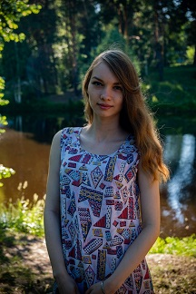

# Alina Cheremisina
**Contacts**: 
1. Discord: Alina_Cherr#5212
2. VK: https://vk.com/idcheremisina_a
3. Phone number: 89105670687

# About me
*My name is Alina Cheremisina. I want to learn how to develop websites. Of the useful skills I have acquired in life, I have perseverance and patience. I easily learn something new.*

**Skills**: I have mastered the HTML markup language and the style language CSS.
## Code examples
`const multiply = (a, b) => a * b;`
## Work experience
*Unfortunately, I don't have any experience in this field, but I would really like to get the JS development skill.* 

[Link on my task] (https://alinacheremisina.github.io/rsschool-cv/cv)
# Education
*At the moment I am getting a higher education by profession as a teacher of Russian language and literature.*
## English language
A1 (*school education*).
